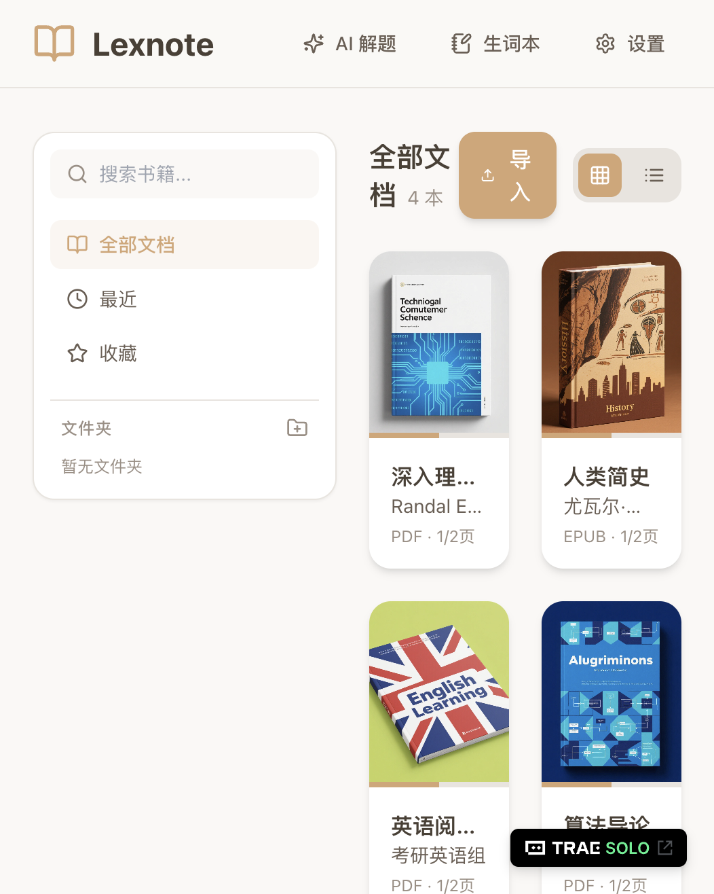
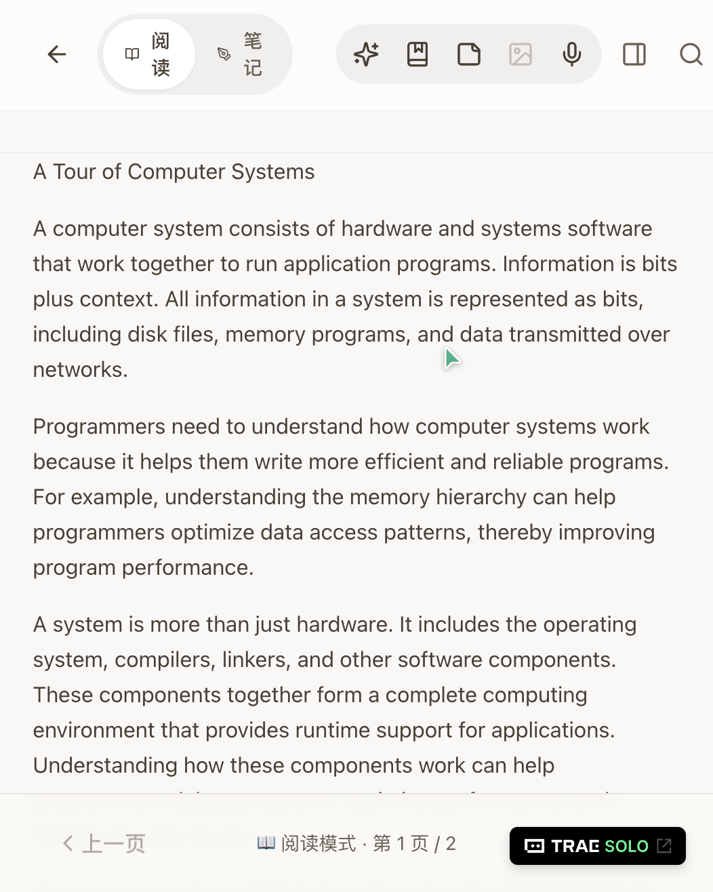
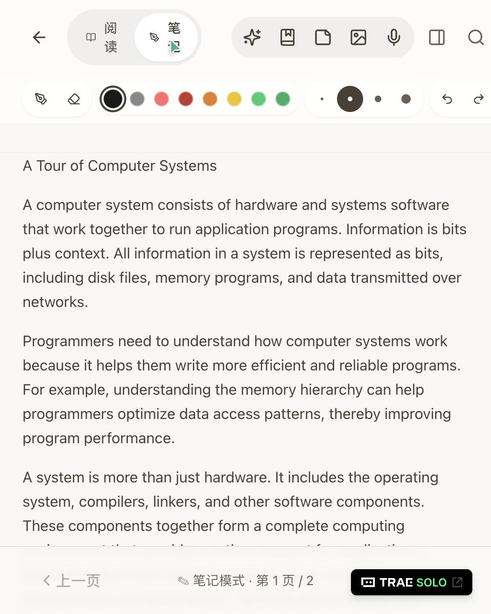

# 学习工作 · Lexnote — AI 智能阅读笔记

大家好！我是 Lexnote 的开发者。这是我使用 TRAE AI IDE 开发的一款面向学生的智能阅读笔记应用，参加学习工作赛道。

---

## 1. Demo 简介

**是什么**：Lexnote 是一款 **iOS / iPadOS 原生应用**，专为 iPad + Apple Pencil 的学习场景打造。本网页版为参加 TRAE 比赛制作的功能展示 Demo，用于在浏览器中直观呈现核心交互体验。

**面向谁**：中学生、大学生、考研党等有大量阅读和笔记需求的学习者，尤其是需要阅读英文文献、PDF 教材、用 Apple Pencil 做手写标注的 iPad 用户。

**主要功能**：

- 📚 **多格式阅读**：支持 PDF、EPUB、TXT 三种格式导入，书架式管理，点击单词即时翻译
- ✍️ **Apple Pencil 手写笔记**：基于 PencilKit 的原生手写体验，支持压感/笔触/颜色/橡皮擦，可直接在文档上标注，阅读与笔记模式一键切换
- 🤖 **AI 智能助手**：集成豆包/GPT-4o/Claude 等多模态大模型，支持划词翻译、语法分析、框选题目 AI 解答、文档总结、生词自动收集

> 📌 **关于本网页版 Demo**：此网页版仅用于 TRAE 参赛展示，使用 tldraw 模拟手写体验。主应用的完整功能（Apple Pencil 压感、PencilKit 笔触、防误触、离线翻译等）请体验 iOS 端。

**书架页面**：导入管理文档，卡片式展示书籍封面，支持搜索和分类


**阅读页面**：沉浸式阅读体验，点击单词即时翻译，选句可进行语法分析和 AI 问答


**笔记模式**：直接在文档上用手写笔做标注，顶部工具栏集成笔刷、颜色、橡皮擦、撤销/重做等


---

## 2. Demo 创作思路

**灵感来源**：作为一个经常需要阅读英文论文和教材的学习者，我发现在 iPad 上学习时需要频繁切换多个应用——PDF 阅读器（GoodNotes/Notability）、翻译工具（欧路词典）、笔记软件（Notability）、AI 助手（ChatGPT）。这些切换打断了学习心流，效率低下。尤其是在考研/读论文场景下，经常需要边读边查词、边读边标注、遇到难题随时问 AI，但现有工具很难同时满足。

**想解决的问题**：
1. **多应用切换痛点**：读英文文献时遇到不认识的单词要切词典，遇到不懂的句子要切 AI，做标记要切笔记软件
2. **iPad 手写体验碎片化**：虽然 GoodNotes 手写很好，但查词和 AI 问答要跳出应用
3. **AI 能力不接地气**：很多阅读工具的 AI 是"通用聊天"，没有针对"选中即问""框选解题""提取生词"等学习场景深度优化

**为什么做这个方向**：
- 选择 **iOS/iPadOS 原生优先**：iPad + Apple Pencil 是学生学习的最佳硬件组合，PencilKit 提供原生级手写体验，防误触、压感、零延迟
- 选择 **阅读+笔记+AI 三位一体**：不是三个独立功能，而是深度整合——单词点一下就翻译，句子选中就可分析，笔记区域框选就能让 AI 解题
- 选择 **网页版作为展示窗口**：为了让 TRAE 评审无需 iPad 也能快速体验核心交互，我同步开发了 Web Demo，在浏览器中即可感受阅读+手写+AI 的完整体验

---

## 3. Demo 体验地址

> ⚠️ 本网页版为参赛展示 Demo，打开后会显示提示弹窗说明 Web 版与 iOS 主应用的关系。

**交互式 HTML 包（推荐）**：随帖上传的 `lexnote-web-dist.zip`，解压后运行：

```bash
cd dist
npx serve .
```

然后访问 http://localhost:3000 即可体验核心功能（书架、阅读、点击翻译、手写笔记）。
如需体验 AI 问答/解题功能，请用源码完整运行：`npm install && npm run build && npm start`，访问 http://localhost:3001。

**在线体验地址**：https://deep-carpets-roll.loca.lt

> ⚠️ localtunnel 安全提示：首次访问需输入页面显示的 IP 地址（如 107.x.x.x）后点击 Continue，验证一次后 7 天内不再提示。
>
> 本地源码运行（开发模式）：`npm install && npm run dev`，访问 http://localhost:5173
>
> 前后端整合部署：`npm install && npm run build && npm start`，访问 http://localhost:3001

**使用说明**：
1. 打开后会弹出演示版本说明，阅读后点击"我知道了"关闭
2. 书架中自带 4 本示例书籍（2 本 PDF + 2 本 EPUB 格式）
3. 点击任意书籍封面进入阅读，点击英文单词可查看翻译（内置离线词典）
4. 点击顶部"笔记"按钮切换到笔记模式，可用鼠标/触控板/手写笔在页面上自由手写标注
5. 点击右上角"设置"可配置 AI API Key（支持豆包/GPT-4o/Claude/Gemini/通义千问等多模型），配置后可使用 AI 问答、语法分析、框选解题等功能

---

## 4. TRAE 实践过程

Lexnote 是完全使用 TRAE AI IDE 开发完成的，从项目初始化、iOS 原生开发、Web Demo 制作到调试部署，全程与 TRAE AI 对话协作。以下是关键开发流程：

### 阶段一：项目架构与原型（2026/6/25 - 6/28）
在 TRAE 中从 0 搭建项目基础：
- 使用 TRAE 的 `/web-dev` 和 `/ios-swift-development` skill 分别初始化 Web 前端和 iOS 原生工程
- Web 端：React + TypeScript + Vite + Zustand + IndexedDB + TailwindCSS
- iOS 端：SwiftUI + PDFKit + PencilKit，部署目标 iOS 26.0
- 实现书架页面和文件导入功能的原型

### 阶段二：阅读器核心开发（2026/7/2 - 7/5）
开发 PDF 和 EPUB 双格式阅读器（Web + iOS 双端）：
- Web 端：集成 PDF.js（Canvas + TextLayer 双层结构）和 epub.js
- iOS 端：使用 PDFKit 和 EPUBKit 原生渲染
- 实现点击单词翻译、划句高亮、选句工具栏功能
- 解决 PDF 缩放后单词定位不准、EPUB iframe 事件穿透等技术难题

### 阶段三：手写笔记模式（2026/7/6 - 7/8）
实现文档上手写标注，iOS 端使用 PencilKit，Web 端使用 tldraw：
- iOS 端：PencilKit 原生手写，防误触（仅允许 Apple Pencil 书写，手指用于滚动）
- Web 端：整合 tldraw v3 画布作为手写层，叠加在文档之上
- 实现阅读/笔记模式切换，笔记内容在两种模式间保持可见
- 解决指针事件冲突（pointer-events 层叠问题）、IntersectionObserver 页面定位问题
- 实现笔刷工具栏（颜色/粗细/橡皮擦/撤销重做），采用 iOS 26 风格毛玻璃设计

### 阶段四：AI 功能集成（2026/7/9）
接入多模态大模型实现智能学习辅助：
- 搭建 Express 后端代理，解决跨域和 API Key 安全问题
- 实现划词翻译、语法分析、框选区域 AI 解题功能
- 实现 AI 文档助手（全文总结、文档问答、生词提取）
- 集成豆包大模型（火山引擎方舟平台），同时支持 GPT-4o/Claude 等模型切换
- 生词本功能，自动收集查询过的单词

### 阶段五：Bug 修复与参赛准备（2026/7/10 - 7/11）
解决遗留问题，完成构建部署与参赛材料：
- 修复导入 PDF 后手写工具栏不显示的问题（IntersectionObserver 页面追踪逻辑）
- 修复 EPUB 文件无法手写的问题（iframe pointer-events 处理）
- 添加 Express 静态文件服务，实现前后端一体化部署
- 添加演示版本提示弹窗，明确 Web Demo 与 iOS 主应用的定位
- 完成生产构建，截图关键页面用于参赛展示

### 关键截图说明

| 截图 | 说明 |
|------|------|
| screenshot-bookshelf.png | 书架页面，展示导入的文档列表，侧边栏分类导航 |
| screenshot-reader.png | 阅读模式，点击单词显示翻译气泡，顶部工具栏可见 |
| screenshot-notemode.png | 笔记模式，顶部显示笔触工具栏（颜色/粗细/橡皮擦），可在文档上直接手写 |
| screenshot-english.png | 英文文章阅读页面，展示 TXT/HTML 内容渲染效果 |

### TRAE 开发 Session ID

Lexnote 项目主要在一个持续 17 天的超长 TRAE 对话中完成开发（TRAE 具备出色的长上下文记忆能力，能够在跨越多天的对话中保持对项目结构、代码约定和待解决问题的完整记忆）。以下是关键 Session ID：

| Session ID | 时间范围 | 关键内容 |
|---|---|---|
| **6a354e274db9ed1e9618ac85** | 2026/6/25 - 7/11 | 主开发会话，包含从原型到完整产品的全部开发工作：iOS 原生端（SwiftUI + PDFKit + PencilKit）、Web Demo 端（React + tldraw + PDF.js）、AI 功能集成（豆包/GPT-4o/Claude 多模型支持）、AI 文档助手、生词本、Bug 修复等 |
| **6a521864cfc0ea3aad9e42c4** | 2026/7/11 | 参赛准备会话，包含项目构建、部署调试、截图采集、展示弹窗添加、参赛文档撰写 |

主会话中三个关键里程碑消息 ID（供验证）：
- 6/25 项目启动：初始原型开发完成
- 7/9 AI 功能集成（消息 ID `6a4f9f68c3363d09118e7486`）：完成 AI 文档助手（全文总结/文档问答/生词提取）
- 7/10 iOS 端防误触修复：解决手指误触书写问题，确保仅 Apple Pencil 可书写

### TRAE 使用心得

1. **跨平台开发无缝切换**：在同一个 TRAE 会话中同时开发 iOS（Swift/SwiftUI）和 Web（React/TypeScript），TRAE 能准确理解两套技术栈的差异并给出正确代码，无需在不同工具间切换
2. **上下文记忆能力强大**：TRAE 能够跨越多天的对话保持项目上下文，记住代码约定（如暖色调配色、iOS 26 毛玻璃风格、文件命名规范），不需要每次重复解释
3. **多文件协同修改**：一个功能需求往往涉及 3-5 个文件的联动修改（前端组件 + 状态管理 + 后端 API + CSS 样式），TRAE 能一次性完成所有相关文件的修改
4. **Bug 诊断高效**：遇到问题时直接描述现象（如"手写笔工具栏不显示"），TRAE 能通过搜索代码快速定位根因——pointer-events 层叠问题、IntersectionObserver 逻辑问题、tldraw v3 CSS 前缀变更（`tl-` → `tlui-`）等都是 TRAE 协助排查的
5. **Skill 生态实用**：`/web-dev` skill 帮助快速搭建前端工程，`/ios-swift-development` skill 确保 iOS 代码符合 Swift 最佳实践，`/software-engineer` skill 保证代码质量

---

## 社区报名帖链接

（请补充：通过审核的社区报名帖链接）
